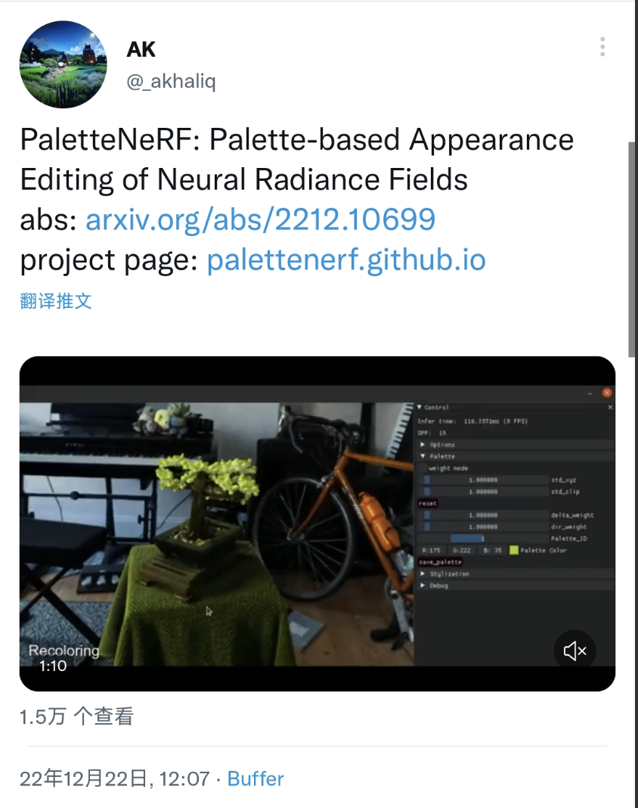

# Track-of-Twitter
A track of twitter messages

---
## 2022 ~12.28
### [@_akhaliq](https://twitter.com/_akhaliq)

* PaletteNeRF: Palette-based Appearance Editing of Neural Radiance Fields.
<!--  -->

* [GeoCode: Interpretable Shape Programs](https://twitter.com/_akhaliq/status/1606116948366004226?s=61&t=HK2fhG-gL9Vsdywj0Atzhg)

### [Jim Fan](https://twitter.com/DrJimFan)

* [Using transformers in diffusion model.](https://twitter.com/drjimfan/status/1605893566575820800?s=61&t=E_gEwaNQzMSLMBC0DuSCKQ)

<!--  -->

### [Yann LeCun](https://twitter.com/ylecun)

### [Matthias Niessner](https://twitter.com/MattNiessner)

* [探讨大型语言模型的未来](https://twitter.com/mattniessner/status/1599843222817472512?s=61&t=HK2fhG-gL9Vsdywj0Atzhg)

* [如何写好论文](https://twitter.com/mattniessner/status/1599344971752296448?s=61&t=HK2fhG-gL9Vsdywj0Atzhg)

* [神经渲染的公开话题](https://twitter.com/mattniessner/status/1595801972967448579?s=61&t=HK2fhG-gL9Vsdywj0Atzhg)

* [做项目的方法论](https://twitter.com/mattniessner/status/1587472203054022657?s=61&t=HK2fhG-gL9Vsdywj0Atzhg)

### [Michael Black](https://twitter.com/Michael_J_Black)

* [对大语言模型的讨论](https://twitter.com/michael_j_black/status/1598957619301187584?s=61&t=HK2fhG-gL9Vsdywj0Atzhg)

* [作者顺序的安排问题](https://twitter.com/michael_j_black/status/1587463427773145090?s=61&t=HK2fhG-gL9Vsdywj0Atzhg)

* [数字人的人种偏倚问题](https://twitter.com/michael_j_black/status/1585514549389803520?s=61&t=HK2fhG-gL9Vsdywj0Atzhg)

* [对数字人未来形式的讨论](https://twitter.com/michael_j_black/status/1581206257951993857?s=61&t=HK2fhG-gL9Vsdywj0Atzhg)

## [Srinath Sridhar](https://twitter.com/drsrinathsridha)

* [对面向三维空间的内容生成探讨](https://twitter.com/drsrinathsridha/status/1596970797079625728?s=61&t=HK2fhG-gL9Vsdywj0Atzhg)

### Interesting Idea

* ChatGPT需要的硬件资源: [@tomgoldsteincs](https://twitter.com/tomgoldsteincs/status/1600196981955100694?s=61&t=HK2fhG-gL9Vsdywj0Atzhg)

### Misc

* [对刚入门做研究的学生建议](https://twitter.com/hsuantienlin/status/1588159935056994310?s=61&t=HK2fhG-gL9Vsdywj0Atzhg)

* [D-NeRF 项目的作者介绍](https://twitter.com/hangg70/status/1587195981518364672?s=61&t=HK2fhG-gL9Vsdywj0Atzhg)

* [LION: 基于扩散模型的点云生成](https://twitter.com/karsten_kreis/status/1582022770669813768?s=61&t=HK2fhG-gL9Vsdywj0Atzhg)

* [跟紧研究的建议](https://twitter.com/lucindaedoyle/status/1573523475394072576?s=61&t=HK2fhG-gL9Vsdywj0Atzhg)

* [建议和老板汇报的时候多用表格](https://twitter.com/davidthewid/status/1572669038010175488?s=61&t=HK2fhG-gL9Vsdywj0Atzhg)

### Misc-Else

* Posdoc 招聘 [@ Autonomous Vision Group, MPI-Tuebingen ](https://twitter.com/autovisiongroup/status/1602306133317787649?s=61&t=HK2fhG-gL9Vsdywj0Atzhg)

* Ph.D面试的准备工作: [Sid Gairola](https://twitter.com/sidgairo18/status/1606029297537257472?s=61&t=HK2fhG-gL9Vsdywj0Atzhg)

* 志愿者招聘: SIGGRAPH 2023 (DDL: 1.19 2023(Team Leader), 2.28 2023(Student Volunteer))

* 介绍加拿大的大学 [Gautam Kamath @ Waterloo](https://twitter.com/thegautamkamath/status/1583442982484574208?s=61&t=HK2fhG-gL9Vsdywj0Atzhg)

* CS课程里缺失的一个学期 [MIT](https://twitter.com/mit_csail/status/1581313961093484545?s=61&t=HK2fhG-gL9Vsdywj0Atzhg) ,[The Missing Semester of Your CS Education](https://missing.csail.mit.edu/)

* 技术战的经验轮 [Hao Chen](https://twitter.com/haoel/status/1575347834974371840?s=61&t=HK2fhG-gL9Vsdywj0Atzhg)

* [教职申请的经验分享](https://twitter.com/xnningxie/status/1607382264039763968?s=61&t=HK2fhG-gL9Vsdywj0Atzhg)